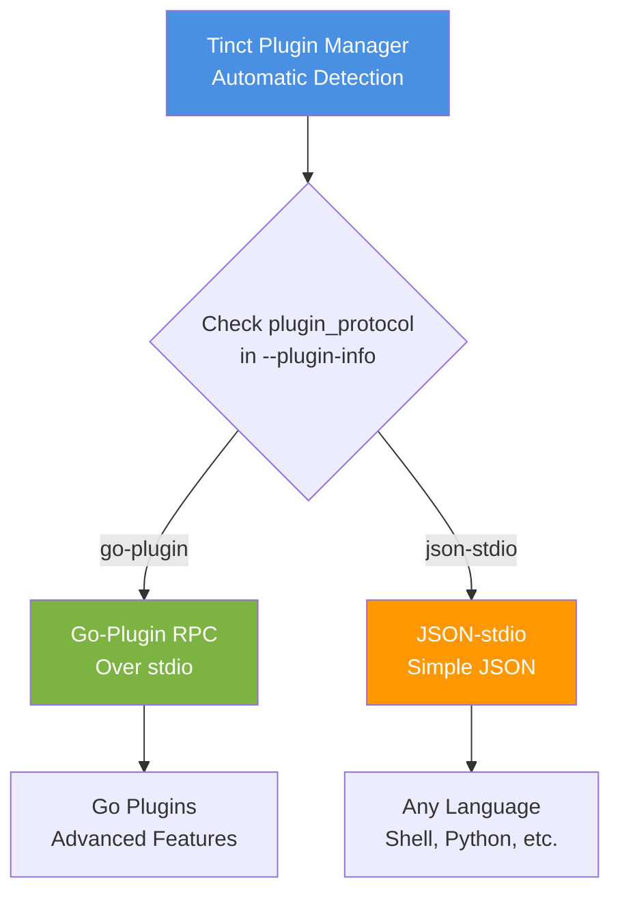

# Plugin Protocols

Tinct supports **two plugin communication protocols** with automatic detection, allowing you to choose the best approach for your needs.

## Overview



## Protocol Comparison

| Feature | JSON-stdio | Go-Plugin (RPC) |
|---------|-----------|-----------------|
| **Languages** | Any (shell, Python, Ruby, etc.) | Go |
| **Communication** | JSON over stdin/stdout | RPC over stdio |
| **Process Model** | New process per invocation | Persistent process (reused) |
| **Startup Cost** | High (fork+exec each time) | Low (RPC to running process) |
| **Isolation** | Basic process isolation | Enhanced with crash recovery |
| **Health Checks** | None | Automatic monitoring |
| **Error Handling** | stderr text | Structured RPC errors |
| **Bidirectional** | No | Yes (plugin can call back) |
| **State** | Stateless | Can maintain state |
| **Dependencies** | None | hashicorp/go-plugin |
| **Complexity** | Minimal | Moderate |

## JSON-stdio Protocol (Simple)

### When to Use
- Writing plugins in shell scripts, Python, Ruby, or any language
- Plugin is simple and short-lived
- Maximum portability
- Minimal dependencies

### How It Works

1. **Plugin Info Query**
   ```bash
   $ my-plugin --plugin-info
   ```
   Output:
   ```json
   {
     "name": "my-plugin",
     "type": "output",
     "version": "1.0.0",
     "protocol_version": "0.0.1",
     "description": "My plugin",
     "plugin_protocol": "json-stdio"
   }
   ```

2. **Execution**
   - Tinct spawns the plugin process
   - Sends data via stdin as JSON
   - Reads response from stdout as JSON
   - Process exits

### Example: Shell Script Plugin

```bash
#!/bin/bash
# tinct-output-my-plugin

set -e

if [[ "$1" == "--plugin-info" ]]; then
  cat <<EOF
{
  "name": "my-plugin",
  "type": "output",
  "version": "1.0.0",
  "protocol_version": "0.0.1",
  "description": "Example shell plugin",
  "plugin_protocol": "json-stdio"
}
EOF
  exit 0
fi

# Read palette from stdin
palette=$(cat)

# Extract colors
bg=$(echo "$palette" | jq -r '.colours.background.hex')
fg=$(echo "$palette" | jq -r '.colours.foreground.hex')

# Generate output
echo "Background: $bg"
echo "Foreground: $fg"
```

### Example: Python Plugin

```python
#!/usr/bin/env python3
import json
import sys

def get_plugin_info():
    return {
        "name": "my-plugin",
        "type": "output",
        "version": "1.0.0",
        "protocol_version": "0.0.1",
        "description": "Example Python plugin",
        "plugin_protocol": "json-stdio"
    }

def main():
    if len(sys.argv) > 1 and sys.argv[1] == "--plugin-info":
        print(json.dumps(get_plugin_info(), indent=2))
        return
    
    # Read palette from stdin
    palette = json.load(sys.stdin)
    
    # Process palette
    bg = palette['colours']['background']['hex']
    fg = palette['colours']['foreground']['hex']
    
    print(f"Background: {bg}")
    print(f"Foreground: {fg}")

if __name__ == "__main__":
    main()
```

## Go-Plugin Protocol (Advanced)

### When to Use
- Writing plugins in Go
- Plugin does heavy computation (benefits from process reuse)
- Need better error handling and crash recovery
- Plugin maintains state between invocations
- Want health monitoring

### How It Works

1. **Plugin Info Query** (same as JSON-stdio)
   ```bash
   $ my-plugin --plugin-info
   ```
   Output:
   ```json
   {
     "name": "my-plugin",
     "type": "output",
     "version": "1.0.0",
     "protocol_version": "0.0.1",
     "description": "My Go plugin",
     "plugin_protocol": "go-plugin"
   }
   ```

2. **Execution**
   - Tinct spawns plugin process once
   - Establishes RPC connection over stdio
   - Makes RPC calls for Generate/PreExecute/PostExecute
   - Process stays alive for reuse
   - Automatic crash recovery if plugin dies

### Example: Go Plugin

```go
package main

import (
    "context"
    "fmt"
    "os"
    
    "github.com/hashicorp/go-plugin"
    "github.com/jmylchreest/tinct/internal/plugin/protocol"
)

type MyPlugin struct{}

func (p *MyPlugin) Generate(ctx context.Context, palette protocol.PaletteData) (map[string][]byte, error) {
    bg := palette.Colours["background"].Hex
    fg := palette.Colours["foreground"].Hex
    
    content := fmt.Sprintf("Background: %s\nForeground: %s\n", bg, fg)
    
    return map[string][]byte{
        "colors.txt": []byte(content),
    }, nil
}

func (p *MyPlugin) PreExecute(ctx context.Context) (bool, string, error) {
    // Optional: validation checks
    return false, "", nil
}

func (p *MyPlugin) PostExecute(ctx context.Context, files []string) error {
    // Optional: post-generation actions
    return nil
}

func (p *MyPlugin) GetMetadata() protocol.PluginInfo {
    return protocol.PluginInfo{
        Name:            "my-plugin",
        Type:            "output",
        Version:         "1.0.0",
        ProtocolVersion: protocol.ProtocolVersion,
        Description:     "Example Go plugin",
        PluginProtocol:  "go-plugin", // Important!
    }
}

func main() {
    // Handle --plugin-info
    if len(os.Args) > 1 && os.Args[1] == "--plugin-info" {
        p := &MyPlugin{}
        info := p.GetMetadata()
        fmt.Printf(`{
  "name": "%s",
  "type": "%s",
  "version": "%s",
  "protocol_version": "%s",
  "description": "%s",
  "plugin_protocol": "%s"
}
`, info.Name, info.Type, info.Version, info.ProtocolVersion, info.Description, info.PluginProtocol)
        os.Exit(0)
    }
    
    // Serve via go-plugin
    plugin.Serve(&plugin.ServeConfig{
        HandshakeConfig: protocol.Handshake,
        Plugins: map[string]plugin.Plugin{
            "output": &protocol.OutputPluginRPC{
                Impl: &MyPlugin{},
            },
        },
    })
}
```

## Unified Data Schema

**Both protocols use identical JSON schemas**, so migrating between them is easy:

### Plugin Info Schema
```json
{
  "name": "plugin-name",
  "type": "input" | "output",
  "version": "semver",
  "protocol_version": "0.0.1",
  "description": "human-readable description",
  "plugin_protocol": "json-stdio" | "go-plugin"
}
```

### Input Options Schema
```json
{
  "verbose": boolean,
  "dry_run": boolean,
  "colour_overrides": ["role=hex", ...],
  "plugin_args": {"key": "value"}
}
```

### Output Palette Schema
```json
{
  "colours": {
    "role": {
      "rgb": {"r": 0-255, "g": 0-255, "b": 0-255},
      "hex": "#rrggbb",
      "role": "role-name",
      "category": "category-name"
    }
  },
  "all_colours": [...],
  "theme_type": "dark" | "light",
  "plugin_args": {"key": "value"},
  "dry_run": boolean
}
```

## Automatic Protocol Detection

Tinct automatically detects which protocol to use:

1. Runs `plugin --plugin-info`
2. Parses the `plugin_protocol` field
3. Uses the appropriate executor:
   - `"go-plugin"` → RPC executor
   - `"json-stdio"` or omitted → JSON executor

**No user configuration needed!**

## Migration Guide

### From JSON-stdio to Go-Plugin

If you have a working JSON-stdio plugin and want better performance:

1. Port your logic to Go
2. Implement the `protocol.OutputPlugin` or `protocol.InputPlugin` interface
3. Change `plugin_protocol` to `"go-plugin"`
4. Add go-plugin serve call

The data schema stays exactly the same!

### From Go-Plugin to JSON-stdio

If you want to simplify or support other languages:

1. Change `plugin_protocol` to `"json-stdio"`
2. Read JSON from stdin instead of using RPC
3. Write JSON to stdout
4. Keep the same data structures

## Performance Comparison

### Benchmark: 100 Invocations

| Protocol | Total Time | Avg per Call | Memory |
|----------|-----------|--------------|--------|
| JSON-stdio | 5.2s | 52ms | Low |
| Go-Plugin | 0.8s | 8ms | Medium |

**Go-Plugin is ~6.5x faster** for repeated invocations due to process reuse.

## Best Practices

### JSON-stdio Plugins
- Keep plugins fast and simple
- Handle errors with non-zero exit codes
- Print errors to stderr, output to stdout
- Support `--plugin-info` flag
- Validate input data

### Go-Plugin Plugins
- Implement all interface methods
- Use context for cancellation
- Return structured errors
- Keep state minimal (plugins may restart)
- Test both RPC and direct calls

## Troubleshooting

### How to check which protocol is being used?

```bash
# Query plugin info
my-plugin --plugin-info | jq .plugin_protocol

# Enable verbose mode to see protocol detection
tinct generate --verbose --input image --output my-plugin
```

### Plugin not working after adding go-plugin?

1. Check `plugin_protocol` field is set to `"go-plugin"`
2. Ensure you're serving via `plugin.Serve()`
3. Check handshake config matches `protocol.Handshake`
4. Verify plugin builds and runs standalone

### How to force a specific protocol?

You can't force it - the plugin declares its protocol via `--plugin-info`. This is intentional to ensure plugins work correctly.

## See Also

- [contrib/plugins/](../contrib/plugins/) - Plugin examples (both JSON-stdio and go-plugin)
- [contrib/plugins/README.md](../contrib/plugins/README.md) - Plugin development guide
- [external-plugins.md](./external-plugins.md) - External plugin documentation
- [HashiCorp go-plugin docs](https://github.com/hashicorp/go-plugin)
